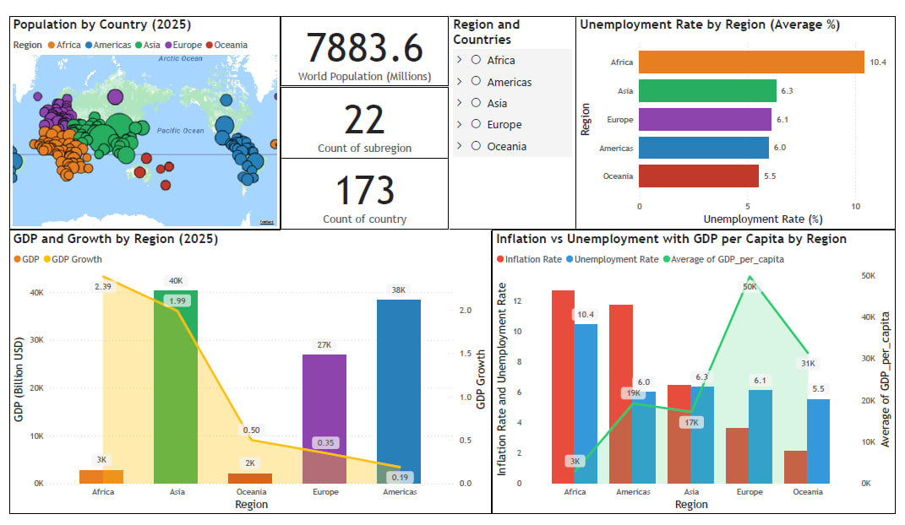

# 🌍 World Economics Dashboard — Power BI Project

## Overview
The **World Economics Dashboard** is an interactive Power BI project designed to analyze and visualize key global economic indicators for the year **2025**.  
It explores how countries and regions compare in terms of **GDP**, **GDP Growth**, **Inflation**, **Unemployment**, and **Population**, offering a clear view of global economic trends and disparities.

  

## Objectives
- Visualize and compare **economic performance** across regions and countries.  
- Identify patterns and correlations between **Inflation**, **Unemployment**, and **GDP per Capita**.  
- Explore **regional aggregates** and **population distribution** to better understand global economic balance.

## Key Visualizations
- **Population by Country (2025)** – global population overview.  
- **Unemployment Rate by Region** – comparison of average unemployment levels across continents.  
- **GDP and GDP Growth by Region** – insights into economic performance and growth trends.  
- **Inflation vs Unemployment (Phillips Curve)** – relationship between inflation, unemployment, and GDP per capita.  
- **Interactive Filters** – dynamic region and country selection for deep exploration.

## Dataset
The dataset contains the following indicators for each country:

| Feature | Description |
|----------|--------------|
| **Region** | Continent or macro-region (Africa, Americas, Asia, Europe, Oceania) |
| **GDP (Billion USD)** | Total Gross Domestic Product |
| **GDP Growth (%)** | Yearly GDP growth rate |
| **Inflation Rate (%)** | Average inflation rate |
| **Unemployment Rate (%)** | Average unemployment rate |
| **GDP per Capita (USD)** | GDP divided by population |
| **Population (Millions)** | Total population per country |

**Coverage Summary:**
- 🌍 173 countries  
- 🌎 22 subregions  
- 👥 ~7.9 billion people (World Population)

## Tools & Technologies
- **Microsoft Power BI Desktop** — dashboard creation & visualization  
- **Excel / CSV** — data preprocessing and cleaning  
- **Azure Maps API** — interactive map visualizations  
- **GitHub** — version control & project sharing  

